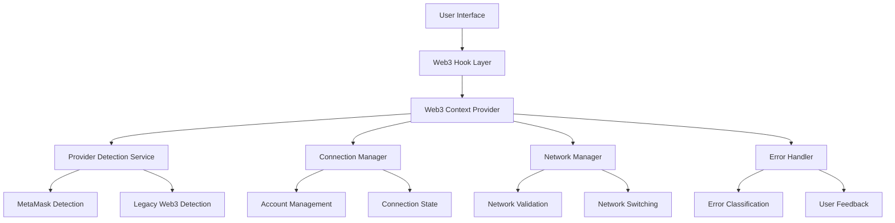
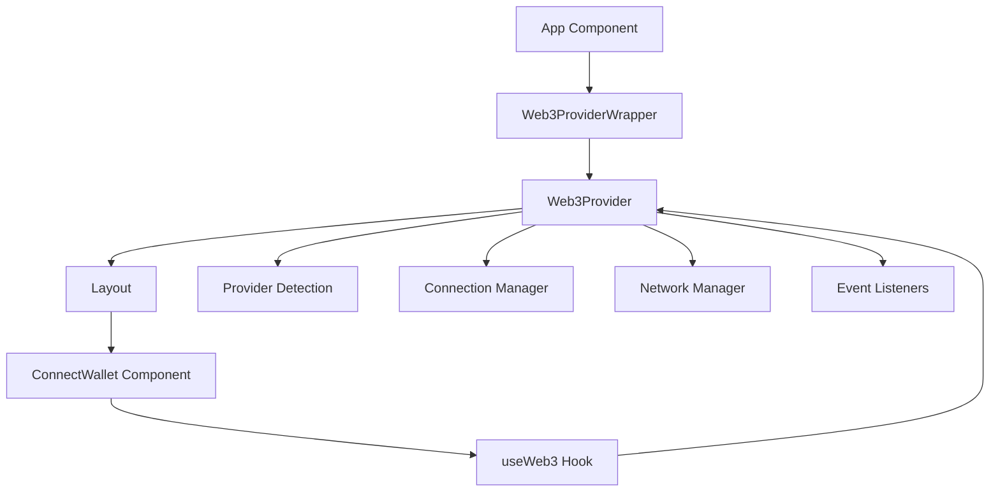
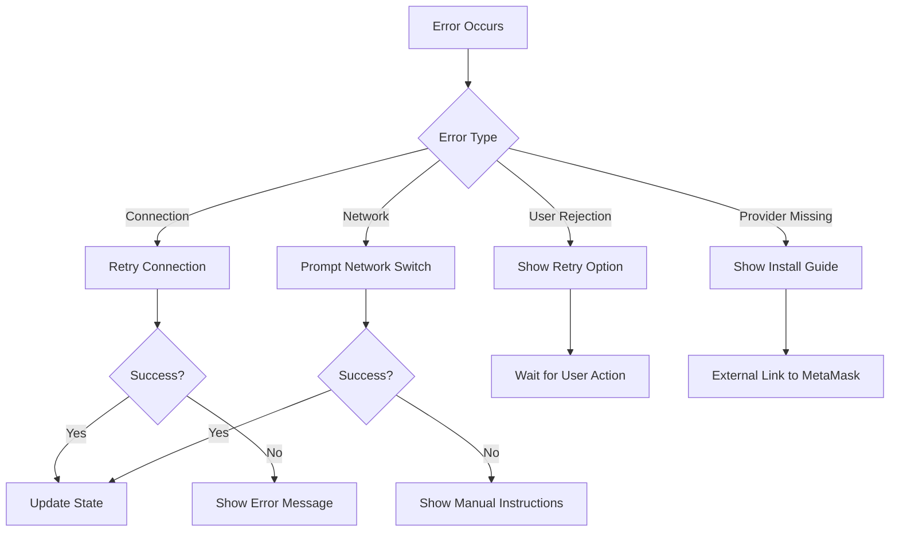

# Design Document

## Overview

Esta solución rediseña completamente el sistema de conexión Web3 para resolver los problemas identificados en la conexión de MetaMask. El diseño se enfoca en crear una arquitectura robusta, mantenible y que maneje correctamente tanto el renderizado del servidor como del cliente, con un manejo de errores comprehensivo y una experiencia de usuario fluida.

## Architecture

### High-Level Architecture



### Component Hierarchy



## Components and Interfaces

### 1. Web3 Context Provider

**Purpose:** Centralizar el estado de Web3 y proporcionar una API consistente para toda la aplicación.

**Key Features:**
- Estado centralizado de conexión
- Manejo automático de eventos de MetaMask
- Renderizado condicional cliente/servidor
- Manejo robusto de errores

**Interface:**
```typescript
interface Web3ContextType {
  // Connection State
  isConnected: boolean;
  isConnecting: boolean;
  account: string | null;
  chainId: string | null;
  
  // Provider Objects
  provider: ethers.providers.Web3Provider | null;
  signer: ethers.Signer | null;
  
  // Network State
  isCorrectNetwork: boolean;
  networkName: string;
  
  // Actions
  connect: () => Promise<boolean>;
  disconnect: () => void;
  switchNetwork: () => Promise<boolean>;
  
  // Error State
  error: string | null;
  clearError: () => void;
}
```

### 2. Provider Detection Service

**Purpose:** Detectar y validar proveedores Web3 disponibles con soporte para múltiples tipos.

**Key Features:**
- Detección de MetaMask moderno (EIP-1193)
- Soporte para proveedores legacy
- Validación de capacidades del proveedor
- Manejo gracioso de ausencia de proveedores

**Interface:**
```typescript
interface ProviderDetectionResult {
  provider: any | null;
  isModern: boolean;
  isMetaMask: boolean;
  capabilities: string[];
  error?: string;
}
```

### 3. Connection Manager

**Purpose:** Manejar el proceso de conexión con diferentes estrategias según el tipo de proveedor.

**Key Features:**
- Estrategias de conexión adaptativas
- Manejo de requests pendientes
- Retry logic inteligente
- Validación de cuentas

**Interface:**
```typescript
interface ConnectionManager {
  connect(provider: any, isModern: boolean): Promise<ConnectionResult>;
  disconnect(): void;
  isConnecting(): boolean;
  getConnectionState(): ConnectionState;
}
```

### 4. Network Manager

**Purpose:** Gestionar la validación y cambio de redes blockchain.

**Key Features:**
- Validación automática de red
- Cambio automático a BSC
- Adición de redes faltantes
- Manejo de errores de red

**Interface:**
```typescript
interface NetworkManager {
  validateNetwork(chainId: string): boolean;
  switchToTargetNetwork(): Promise<boolean>;
  addNetworkToWallet(networkConfig: NetworkConfig): Promise<boolean>;
  getCurrentNetwork(): NetworkInfo;
}
```

### 5. Enhanced ConnectWallet Component

**Purpose:** Interfaz de usuario mejorada para la conexión de wallet con mejor UX.

**Key Features:**
- Estados visuales claros
- Mensajes de error contextuales
- Indicadores de carga
- Menú de información de wallet

## Data Models

### Connection State Model

```typescript
interface ConnectionState {
  status: 'disconnected' | 'connecting' | 'connected' | 'error';
  account: string | null;
  chainId: string | null;
  networkName: string;
  balance: string;
  lastConnected: Date | null;
}
```

### Network Configuration Model

```typescript
interface NetworkConfig {
  chainId: string;
  chainName: string;
  nativeCurrency: {
    name: string;
    symbol: string;
    decimals: number;
  };
  rpcUrls: string[];
  blockExplorerUrls: string[];
}
```

### Error Model

```typescript
interface Web3Error {
  code: number;
  message: string;
  type: 'connection' | 'network' | 'user_rejection' | 'provider' | 'unknown';
  recoverable: boolean;
  userMessage: string;
  actions?: ErrorAction[];
}

interface ErrorAction {
  label: string;
  action: () => void;
  primary?: boolean;
}
```

## Error Handling

### Error Classification System

1. **Connection Errors**
   - Provider not found
   - Connection rejected by user
   - Provider locked/unavailable

2. **Network Errors**
   - Wrong network
   - Network switch failed
   - RPC errors

3. **User Errors**
   - User rejection
   - Insufficient permissions
   - Wallet locked

4. **System Errors**
   - Hydration mismatches
   - Provider initialization failures
   - Unexpected errors

### Error Recovery Strategies



### User-Friendly Error Messages

- **Provider Not Found:** "MetaMask no detectado. Por favor instala MetaMask para continuar."
- **Connection Rejected:** "Conexión rechazada. Haz clic para intentar de nuevo."
- **Wrong Network:** "Red incorrecta detectada. Cambia a Binance Smart Chain."
- **Network Switch Failed:** "No se pudo cambiar la red automáticamente. Instrucciones manuales disponibles."

## Testing Strategy

### Unit Testing

1. **Provider Detection Tests**
   - Test detection of different provider types
   - Test handling of missing providers
   - Test capability validation

2. **Connection Manager Tests**
   - Test connection flow for modern providers
   - Test connection flow for legacy providers
   - Test error handling scenarios

3. **Network Manager Tests**
   - Test network validation
   - Test network switching
   - Test network addition

### Integration Testing

1. **Full Connection Flow**
   - Test complete user journey from disconnected to connected
   - Test network switching during connection
   - Test reconnection after page refresh

2. **Error Scenarios**
   - Test user rejection handling
   - Test network errors
   - Test provider unavailability

3. **State Management**
   - Test context state updates
   - Test event listener handling
   - Test cleanup on unmount

### End-to-End Testing

1. **Browser Compatibility**
   - Test with different browsers
   - Test with different MetaMask versions
   - Test mobile wallet compatibility

2. **Network Scenarios**
   - Test with different networks
   - Test network switching
   - Test offline scenarios

## Implementation Approach

### Phase 1: Core Infrastructure
- Implement new Web3Context with proper SSR handling
- Create provider detection service
- Set up error handling system

### Phase 2: Connection Management
- Implement connection manager with retry logic
- Add network validation and switching
- Create enhanced error messages

### Phase 3: UI Enhancement
- Update ConnectWallet component
- Add loading states and better UX
- Implement user feedback system

### Phase 4: Testing & Optimization
- Add comprehensive test coverage
- Performance optimization
- Cross-browser testing

## Security Considerations

1. **Provider Validation**
   - Validate provider authenticity
   - Check for malicious providers
   - Sanitize provider responses

2. **State Management**
   - Prevent state injection attacks
   - Validate all external inputs
   - Secure error message handling

3. **Network Security**
   - Validate network configurations
   - Prevent network spoofing
   - Secure RPC communications

## Performance Considerations

1. **Lazy Loading**
   - Load Web3 components only when needed
   - Defer provider detection until user interaction

2. **State Optimization**
   - Minimize re-renders
   - Optimize context updates
   - Cache provider instances

3. **Error Handling**
   - Debounce error messages
   - Prevent error loops
   - Optimize retry mechanisms