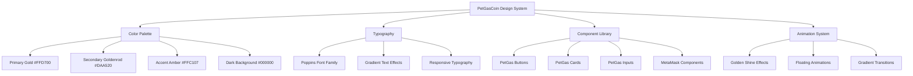
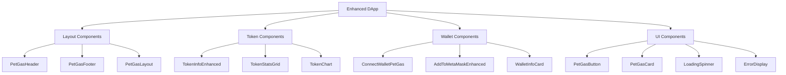

# Design Document

## Overview

This design document outlines the comprehensive enhancement of the PetGasCoin DApp to achieve perfect brand consistency with petgascoin.com, implement robust cross-platform Add to MetaMask functionality, and ensure accurate real-time token data display. The design focuses on creating a professional, cohesive user experience that reflects the PetGasCoin brand identity while providing reliable functionality across all devices.

## Architecture

### Design System Architecture



### Component Architecture



## Components and Interfaces

### 1. PetGasCoin Design System

#### Color Palette
```css
:root {
  /* Primary Colors - Matching petgascoin.com */
  --petgas-gold: #FFD700;
  --petgas-gold-light: #FFEA00;
  --petgas-gold-dark: #B8860B;
  --petgas-goldenrod: #DAA520;
  --petgas-amber: #FFC107;
  
  /* Background Colors */
  --petgas-black: #000000;
  --petgas-dark: #1a1a1a;
  --petgas-gray: #333333;
  
  /* Text Colors */
  --petgas-text-light: #F5DEB3;
  --petgas-text-white: #FFFFFF;
  --petgas-text-muted: #7a7a8c;
  
  /* Gradients */
  --petgas-gradient-primary: linear-gradient(90deg, #FFD700, #FFA500, #FFD700);
  --petgas-gradient-button: linear-gradient(90deg, #FFD700, #DAA520, #FFC107, #FFD700);
  --petgas-gradient-background: linear-gradient(135deg, #000000 0%, #1a1a1a 100%);
}
```

#### Typography System
```css
/* Font Family - Poppins (matching petgascoin.com) */
@import url('https://fonts.googleapis.com/css2?family=Poppins:wght@300;400;500;600;700;800;900&display=swap');

.petgas-text-system {
  font-family: 'Poppins', sans-serif;
}

/* Gradient Text Effects */
.petgas-gradient-text {
  background: var(--petgas-gradient-primary);
  -webkit-background-clip: text;
  background-clip: text;
  color: transparent;
  background-size: 200% auto;
  animation: shine 3s linear infinite;
}

/* Typography Scale */
.petgas-h1 { font-size: 3.5rem; font-weight: 900; }
.petgas-h2 { font-size: 2.5rem; font-weight: 800; }
.petgas-h3 { font-size: 2rem; font-weight: 700; }
.petgas-h4 { font-size: 1.5rem; font-weight: 600; }
.petgas-body { font-size: 1rem; font-weight: 400; }
.petgas-small { font-size: 0.875rem; font-weight: 400; }
```

### 2. Enhanced Layout Components

#### PetGasHeader Component
```typescript
interface PetGasHeaderProps {
  isConnected: boolean;
  account?: string;
  onConnect: () => void;
  onDisconnect: () => void;
}

const PetGasHeader: React.FC<PetGasHeaderProps> = ({
  isConnected,
  account,
  onConnect,
  onDisconnect
}) => {
  return (
    <header className="petgas-header">
      <div className="petgas-navbar">
        <div className="petgas-logo">
          
          <span className="petgas-gradient-text">PetGasCoin</span>
        </div>
        
        <nav className="petgas-nav-links">
          <a href="#dashboard" className="petgas-nav-link">Dashboard</a>
          <a href="#stats" className="petgas-nav-link">Statistics</a>
          <a href="#about" className="petgas-nav-link">About</a>
        </nav>
        
        <div className="petgas-wallet-section">
          {isConnected ? (
            <WalletInfoCard account={account} onDisconnect={onDisconnect} />
          ) : (
            <ConnectWalletPetGas onConnect={onConnect} />
          )}
        </div>
      </div>
    </header>
  );
};
```

#### PetGasLayout Component
```typescript
interface PetGasLayoutProps {
  children: React.ReactNode;
  showParticles?: boolean;
}

const PetGasLayout: React.FC<PetGasLayoutProps> = ({ 
  children, 
  showParticles = true 
}) => {
  return (
    <div className="petgas-layout">
      {showParticles && <ParticleBackground />}
      <PetGasHeader />
      <main className="petgas-main">
        {children}
      </main>
      <PetGasFooter />
    </div>
  );
};
```

### 3. Enhanced Token Components

#### TokenInfoEnhanced Component
```typescript
interface TokenInfoEnhancedProps {
  tokenData: TokenData;
  userBalance: string;
  isLoading: boolean;
  onRefresh: () => void;
}

const TokenInfoEnhanced: React.FC<TokenInfoEnhancedProps> = ({
  tokenData,
  userBalance,
  isLoading,
  onRefresh
}) => {
  return (
    <div className="petgas-token-info">
      <div className="petgas-token-header">
        <div className="petgas-token-identity">
          
          <div className="petgas-token-details">
            <h1 className="petgas-gradient-text">{tokenData.name}</h1>
            <span className="petgas-token-symbol">{tokenData.symbol}</span>
          </div>
        </div>
        
        <div className="petgas-token-actions">
          <AddToMetaMaskEnhanced />
          <RefreshButton onClick={onRefresh} isLoading={isLoading} />
        </div>
      </div>
      
      <TokenStatsGrid tokenData={tokenData} />
      
      {userBalance && (
        <UserBalanceCard balance={userBalance} />
      )}
    </div>
  );
};
```

#### TokenStatsGrid Component
```typescript
interface TokenStatsGridProps {
  tokenData: TokenData;
}

const TokenStatsGrid: React.FC<TokenStatsGridProps> = ({ tokenData }) => {
  const stats = [
    {
      label: 'Max Total Supply',
      value: formatLargeNumber(tokenData.maxTotalSupply),
      icon: '💰',
      color: 'gold'
    },
    {
      label: 'Holders',
      value: formatLargeNumber(tokenData.holders),
      icon: '👥',
      color: 'blue'
    },
    {
      label: 'Total Transfers',
      value: formatLargeNumber(tokenData.totalTransfers),
      icon: '🔄',
      color: 'green'
    },
    {
      label: 'Contract Address',
      value: `${tokenData.contractAddress.slice(0, 6)}...${tokenData.contractAddress.slice(-4)}`,
      icon: '📄',
      color: 'purple'
    }
  ];

  return (
    <div className="petgas-stats-grid">
      {stats.map((stat, index) => (
        <PetGasStatCard key={index} {...stat} />
      ))}
    </div>
  );
};
```

### 4. Enhanced Wallet Components

#### AddToMetaMaskEnhanced Component
```typescript
interface AddToMetaMaskEnhancedProps {
  size?: 'small' | 'medium' | 'large';
  variant?: 'primary' | 'secondary';
  showIcon?: boolean;
}

const AddToMetaMaskEnhanced: React.FC<AddToMetaMaskEnhancedProps> = ({
  size = 'medium',
  variant = 'primary',
  showIcon = true
}) => {
  const { isConnected, chainId, account } = useWeb3();
  const [isAdding, setIsAdding] = useState(false);
  const isMobile = useMobileDetect();
  
  const handleAddToken = async () => {
    setIsAdding(true);
    
    try {
      if (!window.ethereum && isMobile) {
        // Mobile deep link to MetaMask
        const deepLink = `https://metamask.app.link/dapp/${window.location.host}`;
        window.open(deepLink, '_blank');
        toast.success('Opening MetaMask app...', { icon: '📱' });
        return;
      }
      
      if (!window.ethereum) {
        toast.error('Please install MetaMask!');
        window.open('https://metamask.io/download.html', '_blank');
        return;
      }
      
      const wasAdded = await window.ethereum.request({
        method: 'wallet_watchAsset',
        params: {
          type: 'ERC20',
          options: {
            address: PGC_TOKEN.address,
            symbol: PGC_TOKEN.symbol,
            decimals: PGC_TOKEN.decimals,
            image: PGC_TOKEN.image,
            name: PGC_TOKEN.name,
          },
        },
      });
      
      if (wasAdded) {
        toast.success('🎉 PGC token added to MetaMask!', {
          style: {
            background: 'var(--petgas-gradient-primary)',
            color: 'var(--petgas-black)',
            fontWeight: 'bold'
          }
        });
      }
    } catch (error) {
      handleMetaMaskError(error);
    } finally {
      setIsAdding(false);
    }
  };
  
  return (
    <PetGasButton
      onClick={handleAddToken}
      disabled={isAdding || !isConnected}
      size={size}
      variant={variant}
      loading={isAdding}
      className="petgas-add-metamask-btn"
    >
      {showIcon && <MetaMaskIcon />}
      {isAdding ? 'Adding to MetaMask...' : 'Add PGC to MetaMask'}
    </PetGasButton>
  );
};
```

#### ConnectWalletPetGas Component
```typescript
interface ConnectWalletPetGasProps {
  onConnect: () => void;
  size?: 'small' | 'medium' | 'large';
}

const ConnectWalletPetGas: React.FC<ConnectWalletPetGasProps> = ({
  onConnect,
  size = 'medium'
}) => {
  const [isConnecting, setIsConnecting] = useState(false);
  
  const handleConnect = async () => {
    setIsConnecting(true);
    try {
      await onConnect();
    } catch (error) {
      console.error('Connection failed:', error);
    } finally {
      setIsConnecting(false);
    }
  };
  
  return (
    <PetGasButton
      onClick={handleConnect}
      disabled={isConnecting}
      size={size}
      variant="primary"
      loading={isConnecting}
      className="petgas-connect-wallet-btn"
    >
      <WalletIcon />
      {isConnecting ? 'Connecting...' : 'Connect Wallet'}
    </PetGasButton>
  );
};
```

### 5. Enhanced UI Components

#### PetGasButton Component
```typescript
interface PetGasButtonProps {
  children: React.ReactNode;
  onClick?: () => void;
  disabled?: boolean;
  loading?: boolean;
  size?: 'small' | 'medium' | 'large';
  variant?: 'primary' | 'secondary' | 'outline';
  className?: string;
}

const PetGasButton: React.FC<PetGasButtonProps> = ({
  children,
  onClick,
  disabled = false,
  loading = false,
  size = 'medium',
  variant = 'primary',
  className = ''
}) => {
  const sizeClasses = {
    small: 'px-3 py-2 text-sm',
    medium: 'px-6 py-3 text-base',
    large: 'px-8 py-4 text-lg'
  };
  
  const variantClasses = {
    primary: 'petgas-btn-primary',
    secondary: 'petgas-btn-secondary',
    outline: 'petgas-btn-outline'
  };
  
  return (
    <button
      onClick={onClick}
      disabled={disabled || loading}
      className={`
        petgas-button
        ${variantClasses[variant]}
        ${sizeClasses[size]}
        ${disabled ? 'petgas-btn-disabled' : ''}
        ${loading ? 'petgas-btn-loading' : ''}
        ${className}
      `}
    >
      {loading && <LoadingSpinner size="small" />}
      <span className={loading ? 'opacity-0' : ''}>{children}</span>
    </button>
  );
};
```

#### PetGasCard Component
```typescript
interface PetGasCardProps {
  children: React.ReactNode;
  title?: string;
  subtitle?: string;
  variant?: 'default' | 'gradient' | 'glass';
  hoverable?: boolean;
  className?: string;
}

const PetGasCard: React.FC<PetGasCardProps> = ({
  children,
  title,
  subtitle,
  variant = 'default',
  hoverable = true,
  className = ''
}) => {
  return (
    <div className={`
      petgas-card
      petgas-card-${variant}
      ${hoverable ? 'petgas-card-hoverable' : ''}
      ${className}
    `}>
      {(title || subtitle) && (
        <div className="petgas-card-header">
          {title && <h3 className="petgas-card-title">{title}</h3>}
          {subtitle && <p className="petgas-card-subtitle">{subtitle}</p>}
        </div>
      )}
      <div className="petgas-card-content">
        {children}
      </div>
    </div>
  );
};
```

## Data Models

### Token Data Model
```typescript
interface TokenData {
  // Basic token information
  name: string;
  symbol: string;
  decimals: number;
  contractAddress: string;
  logoUrl: string;
  
  // Supply information
  totalSupply: string;
  maxTotalSupply: string;
  
  // Market data
  holders: string;
  totalTransfers: string;
  
  // Metadata
  bscScanUrl: string;
  lastUpdated: string;
  source: 'BSCScan' | 'Fallback';
  error?: string;
}
```

### User Wallet Model
```typescript
interface UserWallet {
  address: string;
  balance: string;
  chainId: number;
  isConnected: boolean;
  isWrongNetwork: boolean;
  provider: 'MetaMask' | 'WalletConnect' | null;
}
```

### App State Model
```typescript
interface AppState {
  // Wallet state
  wallet: UserWallet;
  
  // Token state
  tokenData: TokenData | null;
  isLoadingTokenData: boolean;
  tokenDataError: string | null;
  
  // UI state
  theme: 'dark' | 'light';
  isMobile: boolean;
  isLoading: boolean;
  
  // Feature flags
  features: {
    showParticles: boolean;
    enableAnimations: boolean;
    showAdvancedStats: boolean;
  };
}
```

## Error Handling

### Error Classification System
```typescript
enum ErrorType {
  WALLET_NOT_CONNECTED = 'WALLET_NOT_CONNECTED',
  WRONG_NETWORK = 'WRONG_NETWORK',
  METAMASK_NOT_INSTALLED = 'METAMASK_NOT_INSTALLED',
  USER_REJECTED = 'USER_REJECTED',
  API_ERROR = 'API_ERROR',
  NETWORK_ERROR = 'NETWORK_ERROR',
  UNKNOWN_ERROR = 'UNKNOWN_ERROR'
}

interface AppError {
  type: ErrorType;
  message: string;
  details?: any;
  recoveryAction?: () => void;
  recoveryLabel?: string;
}
```

### Error Recovery Actions
```typescript
const errorRecoveryActions = {
  [ErrorType.WALLET_NOT_CONNECTED]: {
    message: 'Please connect your wallet to continue',
    action: () => connectWallet(),
    label: 'Connect Wallet'
  },
  
  [ErrorType.WRONG_NETWORK]: {
    message: 'Please switch to BSC Mainnet',
    action: () => switchToBSC(),
    label: 'Switch Network'
  },
  
  [ErrorType.METAMASK_NOT_INSTALLED]: {
    message: 'MetaMask is required to use this feature',
    action: () => window.open('https://metamask.io/download.html', '_blank'),
    label: 'Install MetaMask'
  }
};
```

## Testing Strategy

### Component Testing
```typescript
// Example test for AddToMetaMaskEnhanced
describe('AddToMetaMaskEnhanced', () => {
  it('should render correctly when wallet is connected', () => {
    render(
      <Web3Provider>
        <AddToMetaMaskEnhanced />
      </Web3Provider>
    );
    
    expect(screen.getByText('Add PGC to MetaMask')).toBeInTheDocument();
  });
  
  it('should show disabled state when wallet is not connected', () => {
    render(
      <Web3Provider initialState={{ isConnected: false }}>
        <AddToMetaMaskEnhanced />
      </Web3Provider>
    );
    
    expect(screen.getByText('Connect Wallet First')).toBeInTheDocument();
  });
  
  it('should handle mobile deep linking', async () => {
    const mockOpen = jest.spyOn(window, 'open').mockImplementation();
    
    render(
      <Web3Provider initialState={{ isConnected: true, isMobile: true }}>
        <AddToMetaMaskEnhanced />
      </Web3Provider>
    );
    
    fireEvent.click(screen.getByText('Add PGC to MetaMask'));
    
    expect(mockOpen).toHaveBeenCalledWith(
      expect.stringContaining('metamask.app.link'),
      '_blank'
    );
  });
});
```

### Integration Testing
```typescript
// Example integration test
describe('Token Data Integration', () => {
  it('should fetch and display real token data', async () => {
    const mockTokenData = {
      name: 'Petgascoin',
      symbol: 'PGC',
      holders: '297',
      totalSupply: '330000000000'
    };
    
    jest.spyOn(bscScanService, 'getTokenStats').mockResolvedValue(mockTokenData);
    
    render(<TokenInfoEnhanced />);
    
    await waitFor(() => {
      expect(screen.getByText('Petgascoin (PGC)')).toBeInTheDocument();
      expect(screen.getByText('297')).toBeInTheDocument();
    });
  });
});
```

### Visual Regression Testing
```typescript
// Example visual test
describe('Visual Regression Tests', () => {
  it('should match PetGasCoin design system', async () => {
    const component = render(<PetGasButton variant="primary">Test Button</PetGasButton>);
    
    expect(component).toMatchSnapshot();
  });
  
  it('should maintain responsive design', async () => {
    const { container } = render(<TokenInfoEnhanced />);
    
    // Test mobile viewport
    global.innerWidth = 375;
    global.dispatchEvent(new Event('resize'));
    
    expect(container.firstChild).toHaveClass('petgas-responsive');
  });
});
```

## Performance Optimization

### Code Splitting Strategy
```typescript
// Lazy load heavy components
const TokenChart = lazy(() => import('./TokenChart'));
const AdvancedStats = lazy(() => import('./AdvancedStats'));

// Component-level code splitting
const TokenInfoEnhanced = () => {
  return (
    <div>
      <TokenStatsGrid />
      <Suspense fallback={<LoadingSpinner />}>
        <TokenChart />
      </Suspense>
    </div>
  );
};
```

### Caching Strategy
```typescript
// Service worker for API caching
const CACHE_DURATION = 2 * 60 * 1000; // 2 minutes

class TokenDataCache {
  private cache = new Map();
  
  async get(key: string) {
    const cached = this.cache.get(key);
    if (cached && (Date.now() - cached.timestamp) < CACHE_DURATION) {
      return cached.data;
    }
    return null;
  }
  
  set(key: string, data: any) {
    this.cache.set(key, {
      data,
      timestamp: Date.now()
    });
  }
}
```

This design document provides a comprehensive foundation for implementing the PetGasCoin UI enhancements while maintaining brand consistency, ensuring cross-platform functionality, and providing accurate real-time data.